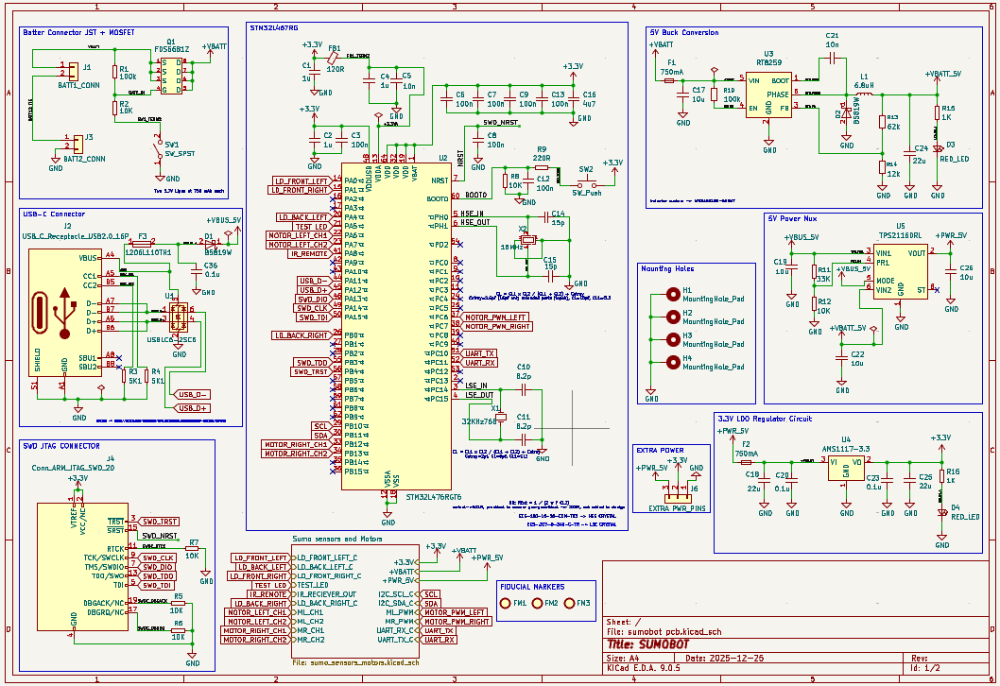
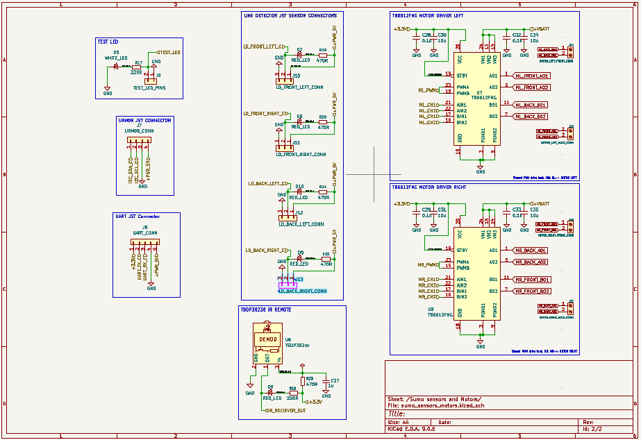
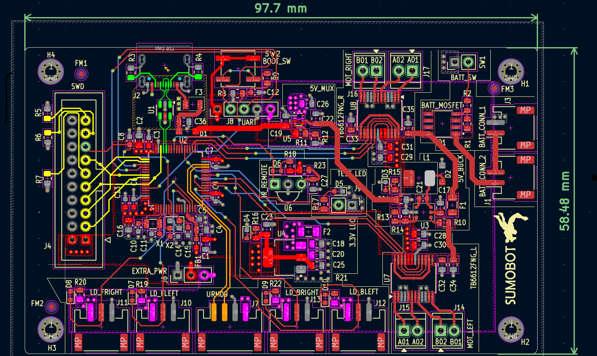
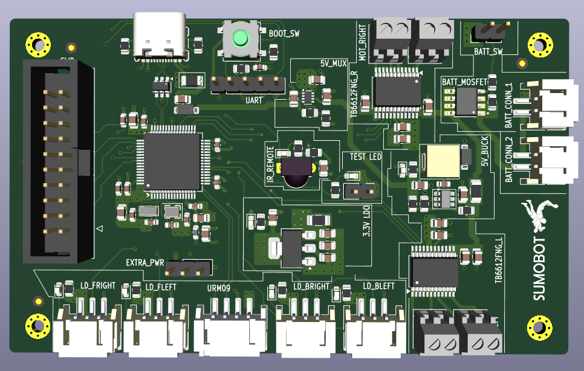
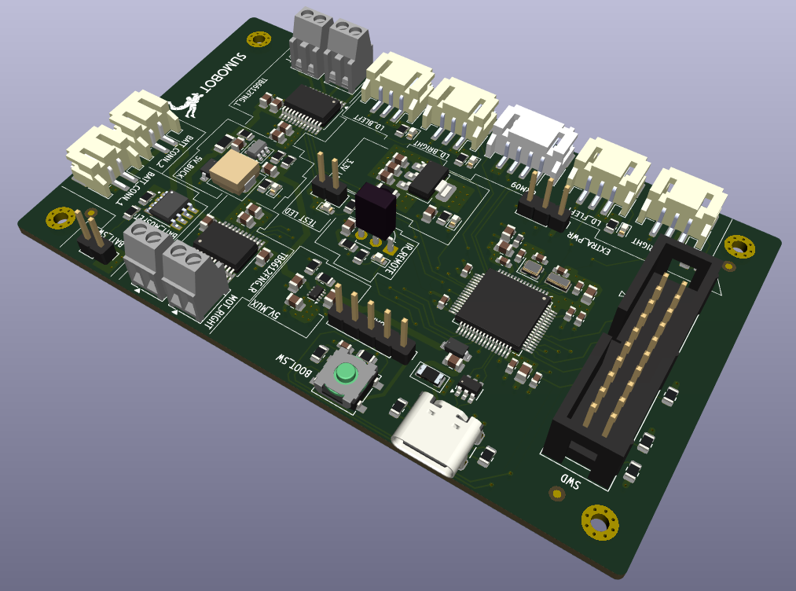

# TSUMO_BOT_hardware

This repository contains the schematic and PCB designs for TSUMO_BOT a sumo robot (12x12cm), created in KiCad and manufactured by JLCPCB. The PCB is a 4-layer board, with an STM32L476RG microcontroller, two motor drivers TB6612FNG, an IR reciever TSP382, MOSFET circuit protection FDS6687, a 5V buck converter RT8259, a 3.3V regulator AMS1117, a 5V power mux TPS2116DRL and a USB-C connector with ESD protection (USBLC6).





## Setup

First clone the repo:

```
git clone https://github.com/troyodia/TSUMO_BOT_hardware.git
```

Import the project into KiCad 9.0 and make sure you have the "default global symbol library table" and the "default footprint library" available. KiCad should find the 3Dmodels and symbols under libs/ automatically. You must manually import the footprints under libs/footprints/ (select "file/add library" from the menu in the footprint editor and add them to the project).
